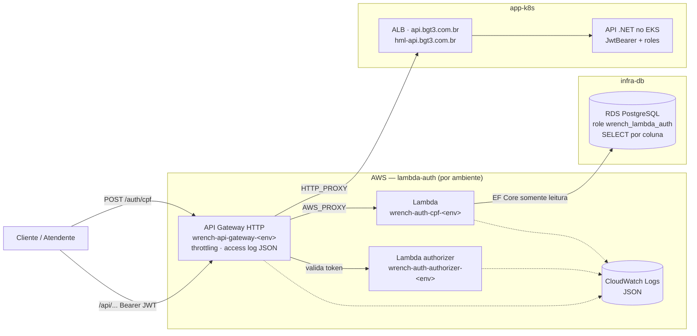

# lambda-auth

Function serverless de autenticação por CPF, Lambda authorizer e **API Gateway** do Wrench Auto Repair.

FIAP · Pós-Tech · 15SOAT · Tech Challenge Fase 3 · Grupo **BGT³**

## Propósito

Este repositório é a borda autenticada do sistema:

1. **Autenticação por CPF** — `POST /auth/cpf` valida o documento, consulta a existência e o status do
   cliente no RDS e devolve um JWT.
2. **Proteção das rotas sensíveis** — o API Gateway encaminha `/api/...` para a API no EKS, e as rotas
   protegidas passam antes por um **Lambda authorizer** que valida o token. Requisição sem token válido
   é recusada na borda e não chega à aplicação.

| Repositório | Conteúdo |
|---|---|
| **lambda-auth** (este) | Lambda de autenticação, Lambda authorizer e API Gateway |
| `app-k8s` | API .NET no EKS, que continua validando token e roles |
| `infra-k8s` | VPC, EKS, ACM, ECR, DNS, SES e observabilidade |
| `infra-db` | RDS PostgreSQL e roles de banco, incluindo o role somente leitura desta function |

## Arquitetura



A sequência completa, com os caminhos de erro, está em
[`app-k8s/docs/diagramas/sequencia-autenticacao.md`](../app-k8s/docs/diagramas/sequencia-autenticacao.md).
As decisões estão no [RFC 002](../app-k8s/docs/rfcs/RFC%20002%20-%20Estrategia%20de%20Autenticacao.md) e no
[ADR 006](../app-k8s/docs/adrs/ADR%20006%20-%20Lambda%20Authorizer.md).

## Tecnologias

- .NET 10 em runtime gerenciado da Lambda (`dotnet10`)
- EF Core 10 com Npgsql, somente leitura e sem migrations
- `System.IdentityModel.Tokens.Jwt` (HS256)
- `DocsBRValidator`, a mesma biblioteca de dígitos verificadores usada pela API
- Amazon API Gateway HTTP API com Lambda authorizer (payload 2.0, respostas simples)
- Terraform com HCP Terraform (organização `bgt3`)
- GitHub Actions
- xUnit e Testcontainers (PostgreSQL 18)

## Rotas do gateway

| Rota | Destino | Authorizer |
|---|---|---|
| `POST /auth/cpf` | Lambda de autenticação | Não |
| `POST /api/v1/autenticacao` | API — login de funcionário por e-mail e senha | Não |
| `PUT /api/v1/usuario/primeiro-acesso` | API — definição de senha | Não |
| `GET /api/v1/ordem-servico/{id}` | API — acompanhamento da OS | Não |
| `GET /health`, `GET /health/ready` | API — healthchecks | Não |
| `GET /docs-ui`, `GET /docs-ui/{proxy+}`, `GET /openapi/{proxy+}` | API — documentação Scalar/OpenAPI | Não |
| `GET /api/v1/ordem-servico/cliente`, `GET /api/v1/ordem-servico/monitoramento` | API | **Sim** |
| `ANY /api/{proxy+}` | API — todas as demais rotas | **Sim** |

As rotas públicas repetem exatamente os endpoints `[AllowAnonymous]` da API. As duas rotas literais
de ordem de serviço existem porque o API Gateway prioriza a rota mais específica: sem elas,
`GET /api/v1/ordem-servico/monitoramento` casaria com a rota pública `{id}` e passaria pela borda sem
authorizer. Os caminhos seguem o formato *slug* da API (`ordem-servico`, minúsculo); o API Gateway
diferencia maiúsculas de minúsculas.

Especificação: [`docs/openapi.yaml`](./docs/openapi.yaml). Coleção Postman com a pasta
**Gateway — autenticação por CPF**:
[`app-k8s/docs/postman/wrench.postman_collection.json`](../app-k8s/docs/postman/wrench.postman_collection.json).

## Contrato com a API (JWT)

O token emitido aqui é validado pela API com `AuthenticationConfiguration`. Qualquer divergência faz
a API responder `401`:

| Item | Valor |
|---|---|
| Algoritmo | HS256, chave convertida em bytes por `Encoding.ASCII` |
| Chave | Secret `JWT_SIGNING_KEY`, o **mesmo valor** nos repositórios `lambda-auth` e `app-k8s`, mínimo de 32 caracteres |
| Issuer / Audience | `Wrench Auto Repair` |
| Claims | `ClaimTypes.NameIdentifier` (id do usuário), `ClaimTypes.Name` (e-mail), `ClaimTypes.Role` (perfil) |
| Expiração | 30 minutos |

O authorizer valida com os mesmos parâmetros da API. A decisão fica em cache no gateway por 300
segundos por token, então um token recém-expirado ainda passa pela borda dentro dessa janela; a API
revalida a expiração em toda requisição.

## Contrato com o banco

A function não referencia nem copia projetos da API. Ela lê as tabelas criadas pelas migrations da
API por um `DbContext` próprio, somente leitura e sem migrations, no database do seu ambiente
(`wrench_auto_repair_hml` em homologação, `wrench_auto_repair` em produção):

| Tabela | Colunas lidas |
|---|---|
| `public."Clientes"` | `Id`, `Documento`, `Email` |
| `public."Usuarios"` | `Id`, `Email`, `PerfilId`, `Ativo` |
| `public."Perfis"` | `Id`, `Nome` |

Relacionamento: `Clientes.Email = Usuarios.Email` e `Usuarios.PerfilId = Perfis.Id`.

- O role `wrench_lambda_auth` tem `SELECT` **somente nessas colunas** (stack `roles/` do `infra-db`).
  Senha, telefone, endereço e nome do cliente ficam inacessíveis.
- O `app-k8s` tem um teste de contrato que verifica essas colunas após as migrations; uma migration
  que as renomeie quebra o PR da API.
- O teste de integração deste repositório cria um role com os mesmos grants e conecta com ele, então
  uma consulta que tocar em coluna fora do contrato falha no CI.

### Regras da autenticação

| Situação | Resposta |
|---|---|
| Documento com dígitos verificadores válidos, cliente com usuário ativo de perfil `Cliente` | `200` com `token`, `username`, `role` |
| Corpo inválido ou documento inválido | `400` |
| Documento sem cliente, ou cliente sem usuário vinculado | `404` |
| Usuário inativo | `403` |
| Usuário vinculado com perfil diferente de `Cliente` | `403` — autenticação sem senha só é permitida para clientes |
| Falha inesperada | `500` com mensagem genérica |

O documento não é registrado em log. O header `X-Correlation-ID` é devolvido na resposta e registrado
no log; quando ausente, a function usa o request id da Lambda.

## Estrutura

```
src/wrench.auto.lambda.auth/     functions, caso de uso, EF Core e JWT
tests/wrench.auto.lambda.auth.tests/
  Unitarios/                     CPF, configuração, token, authorizer
  Integracao/                    function contra PostgreSQL em container com grants por coluna
terraform/                       Lambdas, IAM, logs, API Gateway, authorizer e rotas
docs/openapi.yaml                especificação das rotas do gateway
```

## Execução local

Pré-requisitos: .NET SDK 10 e Docker (para os testes de integração).

```bash
dotnet restore wrench.auto.lambda.auth.sln
dotnet build wrench.auto.lambda.auth.sln
dotnet test wrench.auto.lambda.auth.sln
```

As functions leem configuração só de variáveis de ambiente e **não sobem** sem `JWT_SIGNING_KEY` e,
na autenticação, sem `DATABASE_CONNECTION_STRING`:

| Variável | Function | Descrição |
|---|---|---|
| `JWT_SIGNING_KEY` | ambas | Chave compartilhada com a API |
| `JWT_ISSUER` / `JWT_AUDIENCE` | ambas | Padrão `Wrench Auto Repair` |
| `JWT_EXPIRATION_MINUTES` | autenticação | Padrão `30` |
| `DATABASE_CONNECTION_STRING` | autenticação | Conexão com o role somente leitura |

Não há Dockerfile: a function roda em runtime gerenciado da Lambda e é implantada como pacote ZIP
gerado por `dotnet publish`. Para exercitar a function contra um banco local, rode a API do `app-k8s`
com o `docker-compose` dela (que aplica as migrations) e invoque os handlers pelos testes de
integração ou pela [AWS Lambda Test Tool](https://github.com/aws/aws-lambda-dotnet/tree/master/Tools/LambdaTestTool).

Handlers:

```
wrench.auto.lambda.auth::wrench.auto.lambda.auth.Funcoes.AutenticacaoFunction::HandleAsync
wrench.auto.lambda.auth::wrench.auto.lambda.auth.Funcoes.AuthorizerFunction::HandleAsync
```

## Deploy

| Gatilho | O que acontece |
|---|---|
| Pull request para `develop` ou `master` | Build, auditoria de pacotes vulneráveis, testes, `terraform fmt -check` e `validate` |
| Push em `develop` | Testes, empacotamento e `terraform apply` no ambiente **homologacao** |
| Push em `master` | Testes, empacotamento e `terraform apply` no ambiente **production** |
| `workflow_dispatch` em `ci-cd.yml` | Mesmo fluxo do push, no ambiente da branch escolhida |
| `workflow_dispatch` em `destroy.yml` com `confirmacao=DESTRUIR` | `terraform destroy` do ambiente da branch escolhida |

| Ambiente | Workspace HCP | Recursos | Database | Encaminha para |
|---|---|---|---|---|
| `homologacao` | `wrench_auto_repair_lambda_auth_homologacao` | `wrench-auth-cpf-homologacao`, `wrench-auth-authorizer-homologacao`, `wrench-api-gateway-homologacao` | `wrench_auto_repair_hml` | `https://hml-api.bgt3.com.br` |
| `production` | `wrench_auto_repair_lambda_auth` | `wrench-auth-cpf-production`, `wrench-auth-authorizer-production`, `wrench-api-gateway-production` | `wrench_auto_repair` | `https://api.bgt3.com.br` |

O host vem do output `database_hostname` do workspace do RDS. O database é o output `database_name`
em produção e o mesmo nome com sufixo `_hml` em homologação (output `database_name` deste stack).

O workspace é escolhido por `TF_WORKSPACE` e criado no primeiro `init`, dentro do projeto informado
em `TF_CLOUD_PROJECT`. Ele precisa ficar no mesmo projeto do workspace do RDS, porque o host e o nome
do banco são lidos por `terraform_remote_state` e o compartilhamento de state é por projeto. Em
execução remota no HCP, as credenciais AWS precisam existir no workspace (ou no *variable set* do
projeto). O pacote ZIP é gerado antes do `init` em `terraform/build/`, dentro do diretório enviado ao
HCP; o Terraform não compila código.

A URL do gateway aparece no resumo de cada execução do pipeline e no output `api_gateway_url`.

### Ordem de bootstrap

1. `infra-k8s` e `infra-db` (`rds/` e `roles/`, com os roles e o database de homologação).
2. `app-k8s` em `develop` e em `master` — as migrations criam as tabelas nos dois databases.
3. `infra-db` com `LAMBDA_AUTH_GRANTS_HOMOLOGACAO=true` e `LAMBDA_AUTH_GRANTS_PRODUCTION=true` —
   aplica os grants por coluna do role desta function, que exigem as tabelas existentes.
4. `lambda-auth` em `develop` e em `master`.

O orquestrador de provisionamento do `infra-k8s` executa essa sequência.

### Destruição

O workflow **Destruir Lambda de Autenticação** (`destroy.yml`) remove as Lambdas, o authorizer, o
API Gateway, os log groups e a role IAM do ambiente da branch em que é executado (`develop` →
`homologacao`, `master` → `production`). Só executa com a entrada `confirmacao` igual a `DESTRUIR`.

* Workspace inexistente ou sem recursos é tratado como já destruído; a execução é idempotente.
* O destroy não compila a function: um pacote ZIP provisório satisfaz a referência do Terraform.
* A leitura do state do RDS tolera o banco já destruído, para que a ordem de destruição não trave.
* O orquestrador de destruição do `infra-k8s` executa este workflow antes de remover aplicação,
  banco e cluster.

### Variáveis e secrets

| Nome | Tipo | Descrição |
|---|---|---|
| `AWS_ACCESS_KEY_ID` / `AWS_SECRET_ACCESS_KEY` | secret | Credenciais de deploy |
| `TF_API_TOKEN` | secret | Token do HCP Terraform |
| `JWT_SIGNING_KEY` | secret | Chave de assinatura, idêntica à do `app-k8s` |
| `LAMBDA_AUTH_DB_USERNAME` / `LAMBDA_AUTH_DB_PASSWORD` | secret | Role somente leitura criado pelo `infra-db` |
| `AWS_REGION` | variable | Região AWS |
| `TFC_ORGANIZATION` | variable | Organização do HCP Terraform (`bgt3`) |
| `TFC_WORKSPACE_RDS` | variable | Workspace do stack `rds/` (`wrench_auto_repair_rds`) |
| `TFC_PROJECT` | variable | Projeto do HCP onde os workspaces são criados (padrão `Wrench Auto Repair`) |

Os environments `homologacao` e `production` precisam existir em **Settings → Environments**.

## Documentação relacionada

- [Diagrama de sequência da autenticação](../app-k8s/docs/diagramas/sequencia-autenticacao.md)
- [RFC 002 — Estratégia de autenticação](../app-k8s/docs/rfcs/RFC%20002%20-%20Estrategia%20de%20Autenticacao.md)
- [ADR 006 — Lambda Authorizer no API Gateway](../app-k8s/docs/adrs/ADR%20006%20-%20Lambda%20Authorizer.md)
- [Especificação OpenAPI do gateway](./docs/openapi.yaml)
- [Visão geral dos quatro repositórios](../README.md)
